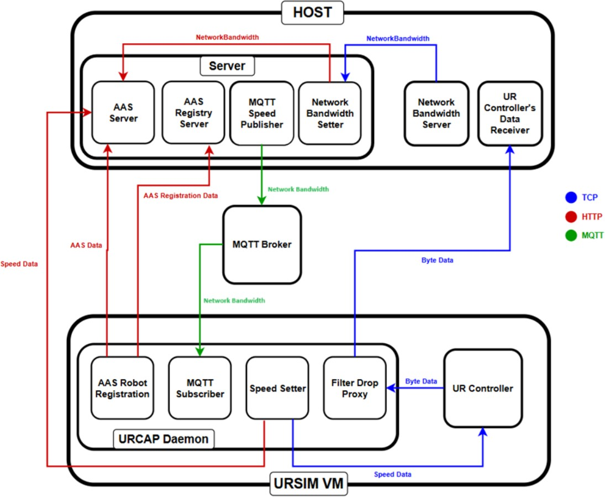

# URSIM_URCAP_CAPIF_repo

 ## Table of Contents
* **[1. Description](#1-description)** 
* **[2. Pre-requirements](#2-pre-requirements)**
* **[3. Installation & Setup](#3-installation--setup)**
    * [3.1. MQTT Broker](#31-mqtt-broker)
    * [3.2. MongoDB](#32-mongodb)
    * [3.3. The installation process of URCap SDK](#33-the-installation-process-of-urcap-sdk)
    * [3.4. Setting up the Virtual Machine of URSIM](#34-setting-up-the-virtual-machine-of-ursim)
    * [3.5. Configure the components](#35-configuration-of-the-components)
        * *[3.5.1. NetworkBandwidthSenderServer](#351-networkbandwidthsenderserver)*
        * *[3.5.2. AASServer](#352-aasserver)*
        * *[3.5.3. URCap Proxy](#353-urcap-proxy)*
        * *[3.5.4. Client](#354-client)*
* **[4. Usage](#4-usage)**
    * [4.1. Start the NetworkBandwidthSenderServer](#41-start-the-networkbandwidthsenderserver)
    * [4.2. Start the AASServer](#42-start-the-aasserver)
    * [4.3. URCap build](#43-urcap-build)
    * [4.4. Start the Robot's program](#44-start-the-robots-program)
    * [4.5. Start the Client](#45-start-the-client)
* **[5. Examination](#5-examination)**


## 1. Description
>>### Introduction
>><p style="text-align: justify;">In the era of Industry 4.0, also known as the fourth industrial revolution, cloud-controlled robotics is an exceptionally important and currently intensively researched
>>area. Furthermore, programmable network applications are nowadays a key part of
>>industrial automation and communication.</p>
>><p style="text-align: justify;">The topic of the thesis is the extension and presentation of an Industry 4.0
>>application platform. The main goal of the application is to serve network resource control
>>requests to efficiently manage robotics and network traffic. For this, the Asset
>>Administration Shell (AAS) specified by Plattform Industry 4.0 is essential, which allows
>>the physical aspects of various devices to be represented in a standardized digital form.
>>This ensures information exchange and includes the main functions, properties, and
>>characteristics. Network communication plays an important role in automation, where REST API
>>calls are used for device registration, and the TCP and MQTT protocols provide solutions
>>for dynamically changing data.</p>
>
>>### Structure of the implemented System
>><p style="text-align: justify;">In this thesis, I will describe every detail of each of the main
>>elements step-by- step. But first, I want to seize the opportunity to present an overview of the
>>system that has been created. The following image illustrates the communication between
>>the different components and represents their place in the architecture. Let’s examine the most
>>important tasks and their participants (the listing follows a chronological timeline):</p>
>>
>>
>>* **Network Bandwidth Server – Network Bandwidth Setter – AAS Server:**
>>    <p style="text-align: justify;">The Network Bandwidth Server transmits the speed value (in practice the value could be 100 or 1000), which changes at random intervals (on port 9000), to the Network Bandwidth Setter. Subsequently, the Network Bandwidth Setter modifies the Network AAS (Asset Administration Shell)’s Network Bandwidth Submodel Element’s value on the AAS Server by using the received data from the server.</p>
>>
>>
>>* **MQTT Speed Publisher – MQTT Broker:**
    <p style="text-align: justify;">The MQTT Speed Publisher transmits network bandwidth data to the MQTT Broker using the 'network/bandwidth' topic. This transmission is based on the current network bandwidth, with the data being sent through port 1883. Naturally, the actual speed is contingent upon the available bandwidth, which means the value could range from 100 to 1000, depending on the network conditions at the time of transmission.</p>
>>
>>
>>* **AAS Robot Registration – AAS Registry Server / AAS Server:**
    <p style="text-align: justify;">The AAS Robot Registration’s process begins by registering the robot on the AAS Registry Server on port 4000. This server holds main data, including the endpoints of the AAS Server, among other essential information. Following this initial step, the robot’s AAS is then registered on the AAS Server, encompassing all relevant details about the robot. Both of these communications are executed using HTTP REST API calls on port 4001.</p>
>>
>>
>>* **MQTT Subscriber – MQTT Broker:**
    <p style="text-align: justify;">The MQTT Subscriber retrieves the current speed value from the 'network/bandwidth' topic on port 1883.</p>
>>
>>
>>* **Speed Setter – AAS Server – UR Controller:**
    <p style="text-align: justify;">The Speed Setter initially configures the UR robot’s speed according to the value received by the MQTT Subscriber from the Broker. Upon successful execution of this step, it proceeds to update the relevant property of the registered robot’s AAS on the AAS Server. This update is performed using an HTTP REST API call directed to port 4001, ensuring that the latest speed setting is accurately reflected in the system.</p>
>>
>>
>>* **UR Controller – Filter Drop Proxy – UR Controller’s Data Receiver:**
    <p style="text-align: justify;">The Filter Drop Proxy receives byte-formatted information about the robot through port 30013 from the UR Controller. Based on the actual speed and network bandwidth, it adjusts the data flow frequency accordingly. This means the communication frequency between the Filter Drop Proxy and the UR Controller’s Data Receiver can be filtered to either 500 Hz or 50 Hz, ensuring optimal data transmission based on the current network conditions.
>>
>><p style="text-align: justify;">Certain components in our system hold symbolic significance and could be replaced in practice. These components are the Network Bandwidth Server and the UR Controller’s Data Receiver (mentioned as client in this paragraph). The server’s origins can be traced back to the work conducted during the professional practice, as mentioned in the “History And Motivation” section of this documentation. This implies that we will be able to integrate this system with ROS programs in the future to simulate the process outlined in this thesis. At last, but not least, the client represents the ROS driver, which will receive the robot’s key information from the UR Controller through the Proxy.</p>

## 2. Pre-requirements
* **Update** the package list:
    ```bash
    sudo apt update
    ```
* Install **Maven** with the following command:
    ```bash
    sudo apt install maven
    ```

* Install Oracle's **Java SDK** (at least Java 11):
 
  Download JDK 11 from Oracle's official site, then install it.
    ```bash
    sudo dpkg -i jdk-<expected java version>.deb
    ```

* Install **Python** (>=Python 2.6):
    ```bash
    sudo apt install python3
    sudo apt install python-is-python3
    ```
  
* Download the Eclipse BaSyx SDK with the following command:
    ```bash
    git clone https://github.com/eclipse-basyx/basyx-java-sdk.git
    ```
  Install the SDK with Maven by navigating into the downloaded repository's directory and run the following command from your terminal:
    ```bash
    mvn clean install -U -DskipTests
    ```

## 3. Installation & Setup

### 3.1. MQTT Broker
For the MQTT Communication we need an MQTT Broker, so first of all we have to install `mosquitto` from our terminal with the following command:
  ```bash
  sudo apt install mosquitto
  ```

* We are able to check status, enable/disable, start, restart and stop our mosquitto broker with the proper commands of the following:
  ```bash
  sudo systemctl status mosquitto
  sudo systemctl enable mosquitto
  sudo systemctl disable mosquitto
  sudo systemctl start mosquitto
  sudo systemctl restart mosquitto
  sudo systemctl stop mosquitto
  ```

* If the `1883` port is already in use, we can make it free easily with these commands (identify Process ID of port `1883`, if it is used by any other process, we "kill" it), then we are able to start our broker without any issue:
  ```bash
  sudo lsof -i :1883
  sudo kill -9 <PID>
  ```

* Configure the `mosquitto.conf` file to make the Broker accessable for everybody:
  ```bash
  sudo nano /etc/mosquitto/mosquitto.conf
  ```
  * Insert these lines, then save the file:
    ```bash
    listener 1883 0.0.0.0
    allow_anonymous true
    ```
* Restart the Broker and check that it's working properly:
  ```bash
  sudo systemctl restart mosquitto
  sudo systemctl status mosquitto
  ```

### 3.2. MongoDB
For our AAS Server we have to install MongoDB to be able to create databases and to be able to check them through an application with GUI (MongoDB Compass).
As our first step we have to download and install our MongoDB Server (Community Edition) and the MongoDB Compass from the official sites of MongoDB.

* MongoDB Server: https://www.mongodb.com/try/download/community
* MongoDB Compass: https://www.mongodb.com/try/download/shell

After download, we have to install MongoDB Server and MongoDB Compass with these commands:
  ```bash
  sudo dpkg -i mongodb-org-server_<verion number>_amd64.deb
  sudo dpkg -i mongodb-compass_<version number>_amd64.deb
  ```

As our last step we can check status, enable/disable, start, restart and stop our MongoDB Server:
  ```bash
  sudo systemctl status mongod
  sudo systemctl enable mongod
  sudo systemctl disable mongod
  sudo systemctl start mongod
  sudo systemctl restart mongod
  sudo systemctl stop mongod
  ```

### 3.3. The installation process of URCap SDK

* Create an account on [Universal Robots' official site](https://www.universal-robots.com/), then sign in.

* Download the latest [URCap SDK from Universal Robots' official site](https://www.universal-robots.com/download/software-e-series/support/urcaps-sdk/) (sdk-1.15.0.zip).

* Extract the ZIP file, then follow the next steps depending on your environment:

    ***- Ubuntu 20.04 or older versions:***
    * Run the following command in the terminal in the `sdk-1.15.0` directory:
        ```bash
        ./install.sh
        ```
    * During the installation accept the recommended packages by pressing `Y`, then `Enter`. If the installation was successful, you can move on to the next step.

    ***- Ubuntu 22.04 and newer versions:***
    * **Install `tar` and `lib32gcc-s1`, `libncurses6` instead of `lib32gcc1` and `libncurses5`, because it was renamed in these distros' repositories:**
        ```bash
        sudo apt install tar lib32gcc-s1 libncurses6
        ```
    * **Open the `install.sh` file and modify the code by:**
        * commenting out `lib32gcc1` in *line 126* to the following: `sudo apt-get install -y libc6-i386 #lib32gcc1`,
        * and overwriting *line 127* from `sudo dpkg -i urtool/*.deb` to `sudo dpkg -i urtool/new_urtool.deb`.

    * **Navigate to the `urtool` directory with `cd` in the terminal, then extract the archive data:**
        ```bash
        cd urtool
        ar x urtool3_0.3_amd64.deb
        ```
        Now the following list of files appear:
        * `control.tar.gz`,
        * `data.tar.gz`,
        * `debian-binary`.
            
        The dependency data is in `control.tar.gz`.

    * **Create a new directory and extract the control archive there with the following commands:**
        ```bash
        mkdir extras-control
        tar -C extras-control -zxf control.tar.gz
        ```
        Now you should see the following files inside `extras-control`:
        * `conffiles`,
        * `control`,
        * `md5sums`,
        * `postinst`,
        * `postrm`,
        * `shlibs`.
            
        The dependency info is inside the `control` file, so open it with any text editor and change the line:
        * from `Depends: lib32gcc1, ..., libncurses5`
        * to `Depends: lib32gcc-s1, ..., libncurses6`

    * **Now, that the changes are done, let's put it back together.**
        * Package the files of the unpacked `.tar` directory and move it to the outer one:
            ```bash
            tar cfz control.tar.gz *
            mv control.tar.gz ..
            ```
        * Now in the outer directory package the following list of files into a *debian* package called `new_urtool.deb`.
            ```bash
            ar r new_urtool.deb debian-binary control.tar.gz data.tar.gz 
            ```
        * Run the installation file from the terminal:
            ```bash
            ./install.sh
            ```
        * During the installation accept the recommended packages by pressing `Y`, then `Enter`. If the installation was successful, you can move on to the next step.

### 3.4. Setting up the Virtual Machine of URSIM
* Download and install the corresponding package of [Virtualbox](https://www.virtualbox.org/wiki/Linux_Downloads), or use the following command:
  ```bash
  sudo apt install virtualbox
  ```
    
* Download the `.rar` file from the official site of Universal Robots. Only one of these packages are needed, so you can choose any of them.
    * You have to create an account to download the `.rar` file from [Offline Simulator - e-Series and UR20/UR30 - UR Sim for non Linux 5.17.0](https://www.universal-robots.com/download/software-ur20ur30/simulator-non-linux/offline-simulator-e-series-and-ur20ur30-ur-sim-for-non-linux-5170/).
    * It is also a good option to work with [Offline Simulator - e-Series - UR Sim for non Linux 5.12.6 LTS](https://www.universal-robots.com/download/software-e-series/simulator-non-linux/offline-simulator-e-series-ur-sim-for-non-linux-5126-lts/).

* Extract the `.rar` file, then open VirtualBox. Click on the `+` (Add) button, navigate to the extracted `URSim_VIRTUAL-5.17.0.128818/` directory and select the `URSim_VIRTUAL-5.17.0.128818.vbox` file. Don't forget to change the VM's `Settings/Network/Adapter1/Attached to:` preset from `NAT` to `Bridged Adapter`.

* Start the VM, then open a terminal (in the URSIM VM) with `Ctrl`+`Alt`+`T` and get the IP address with the following command:
    ```bash
    hostname -I
    ```
    ***This IP address will be important later!***

* Finally, create a new text file called `NumberID.txt` in the `/home/ur/ursim-current/.urcaps/` directory on the VM.

### 3.5. Configuration of the components
**Clone the repository:**
This repository contains the directory of the **Proxy**, the **AASServer**, the **NetworkBandwidthSenderServer** and the **Client**, everything else should have been downloaded and installed separately.
``` bash
git clone "<repository URL>"
```

#### 3.5.1. NetworkBandwidthSenderServer
* Navigate to the `NetworkBandwidthSenderServer/src` directory:
    ```bash
    cd NetworkBandwidthSenderServer/src
    ```
* The **NetworkBandwidthSenderServer** uses the `port 9000`.
* Compile the file:
    ```bash
    javac NetworkNamdwidthSenderServer.java
    ```

#### 3.5.2. AASServer
* Edit the `Proxy.java` file in the `AASServer/src/main/java/AASServer/` directory by replacing the values at the comments: `//yourHostsIpAddress` to your host's IP address.

#### 3.5.3. URCap Proxy

* Navigate to the `Proxy/com.ur.urcap.daemon` directory:
    ```bash
    cd Proxy/com.ur.urcap.daemon/
    ```

* Edit the `pom.xml` file and insert your VM's IP address replacing `yourVMsIpAddress`:
    ```xml
    ...
    <!-- Host and standard user/password for UR Sim running in a VM -->
		<ursimvm.install.host>yourVMsIpAddress</ursimvm.install.host>
    ...
    ```

* Edit the `Proxy.java`, `Registration.java` and the `SpeedSetterFunction.java` files by replacing the values at the comments: `//yourHostsIpAddress` to your host's IP address.
  For example:
  ```java
    ...
    public class Proxy
    {
        private final String networkBandwidthSenderServersAddress = "yourHostsIpAddress";
    ...
    ``` 

* Finally, you have to edit the endpoints in the JSON files that you can find in the `AASServer/src/main/resources/JSONs/RegistryServersJSONs` and in the `Proxy/com.ur.urcap.daemon/src/main/resources/JSONs/RegistryServersJSONs/` directories.

#### 3.5.4. Client
* Navigate to the `Client/src` directory:
    ```bash
    cd Client/src/
    ```
* Set your VM's IP address by replacing the `proxysAddress` attribute's value in the `App.java` file:
    ```java
    ...
    public class App {
    public static void main(String[] args) {
        String proxysAddress = "yourVMsIpAddress";
    ...
    ```
* The **Client** uses the `port 9001`.
* Compile the file:
    ```bash
    javac App.java
    ```

## 4. Usage
Every component needs a terminal (*4.1., 4.2., 4.3., 4.5.*), therefore open 4 terminals first.

#### 4.1. Start the NetworkBandwidthSenderServer
* Relative Path: `NetworkBandwidthSenderServer/src/`
* Start the server:
    ```bash
    java NetworkBandwidthSenderServer
    ```

#### 4.2. Start the AASServer
* Relative Path: `AASServer/src/main/java/AASServer/`
* Start the `AASServer.java`'s services in any IDE (For example: IntelliJ).
* Wait a few seconds before you start the next step, so everything will work properly.

#### 4.3. URCap build
* Start your virtual machine of URSIM in VirtualBox.
* Relative Path: `Proxy/com.ur.urcap.daemon/`
* Run the following commands in your terminal:
    ```bash
    mvn install
    mvn install -P ursimvm -U
    ```

#### 4.4. Start the Robot's program
* Start any URSim UR application on the VM, for example `URSim UR3`.
* Power on the robot, then start it, after that click on **`Exit`**.
* In the **`Installation`** menu select **`URCaps`**, then the **`Daemon`**.
* It will automatically start the daemon, but it won't work properly, so stop it with the **`Stop Daemon`** button (an error message will appear, close the popup), then click on the **`Start Daemon`** button.
* Now the speed scale is changing just as it should.

#### 4.5. Start the Client
* Relative Path: `Client/src/`
* Start the client:
    ```bash
    java App
    ```
  
### 5. Examination
* Open **MongoDB Compass** to check that every asset has been registered into the database and the values of the Properties are changing properly.
* You can also check that the frequency is changing with **Wireshark** by filtering the TCP communication between the `Proxy` and the `Client`
