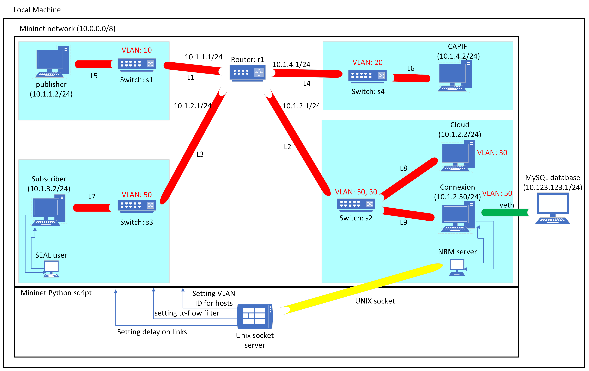
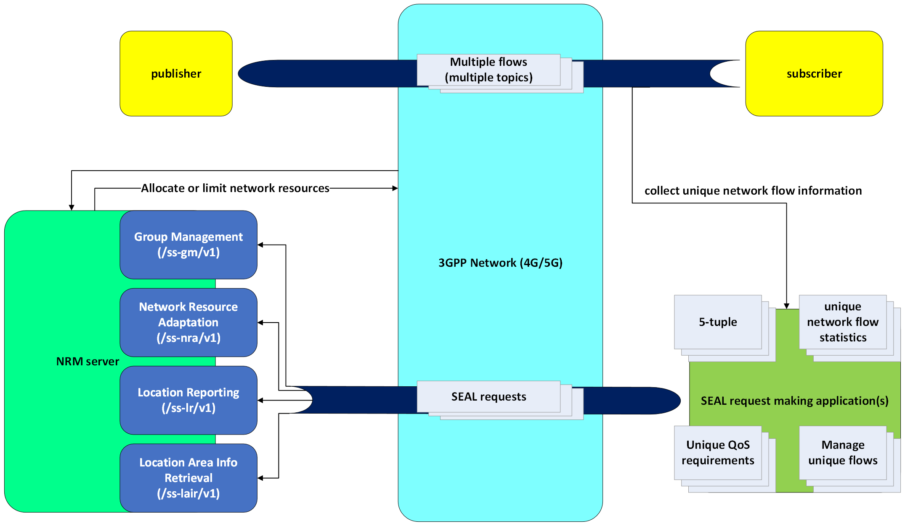

# Mininet

This part uses Mininet in Python script to emulate networks to test the NRM server simulation.

## Tests in the tests folder

* NRM_sim_server_short_test_no_vlan_not_ordered_links
* NRM_sim_server_short_test_no_vlan_ordered_links
* NRM_sim_server_short_test_with_vlan
* NRM_sim_server_opc-ua_test

The "NRM_sim_server_short_test_no_vlan_*" sets bandwidth based on 5-tuple information. Without 5-tuple it sets the entire link's bandwidth.
A tc-flow filter is used to limit the specific communications bandwidth, which can be updated.
It sets delay based the link specified by the NRM server. The Vlan ID is accepted, but not set in this example.
Success and failure to set values is sent back.
The main difference between the "ordered_inks" and "not_ordered_links" versions, is whether the links are added before or after the Mininet object was built.
The ordered version adds links after the Mininet build process, while the not ordered version does it before the building process.


The "NRM_sim_server_short_test_with_vlan" sets bandwidth and delay similarly to the "NRM_sim_server_short_test_no_vlan".
The difference is, that the hosts are replaced with VLANHOSTs, which use VLAN tags. The VLAN IDs are configured at start and NRM server can change them, when receiving Group Management requests (POST, PATCH, PUT).

The final test's ("NRM_sim_server_opc-ua_test") difference is that, the Network Resource Adapation SEAL request is made based on the OPC UA PubSub communication.
This test is not yet complete, because it still needs testing, but will be uploaded by the end of next week.

### Network topology built for the NRM_sim_server_short_test_no_vlan_* tests



The MySQL database is outside the Mininet hosts and network. It is running on the local machine and a virtual ethernet interface directly connects it to the NRM side.
This mimics the idea, that the database is on private network, which is inaccessible to the rest of the network.

### Simplified diagram for the OPC UA test



This diagram illustrates the communication of the communicating machines/applications and the SEAL request making script.
This is applicable most the OPC UA test, but it can be aplied to the other tests too, by looking at the publisher and subscriber as machines.

## How to run 

- NRM_sim_server_short_test_no_vlan_not_ordered_links
This test case accepts SEAL requests for managing QCI/bandwidth of a 5-tuple communication.
This focuses on the NRM server and its APIs.
The links are not ordered, which means, that a topology object is created first, and later Mininet builds it in whatever order the underlying implementation decides.
From experience, this is not the order the links are added to the topology.

```
sudo python3 NRM_sim_server_short_test_no_vlan_not_ordered_links.py
```

- NRM_sim_server_short_test_no_vlan_ordered_links
This test case accepts SEAL requests for managing QCI/bandwidth of a 5-tuple communication.
This focuses on the NRM server and its APIs.
The links are ordered, which meand that the Mininet network is initialized/built first and the links are added later by the script.
This allows the links to be ordered in the Mininet.links array in the desired order, if network resource allocation demands link level resource change (bandwidth, delay, etc.), then this is the way.
This is only used for delay setting. The bandwidth limit is set by qdisc, to only limit the specific 5-tuple communication and leave bandwidth for other communications as well.

```
sudo python3 NRM_sim_server_short_test_no_vlan_ordered_links.py
```

- NRM_sim_server_short_test_with_vlan
This test works similarly to the NRM_sim_server_short_test_no_vlan_ordered_links. 
The difference is that it also sets the VLAN ID of the hosts (VlanHost), when Group Management requires it.

```
sudo python3 NRM_sim_server_short_test_with_vlan.py
```

Commands were run from the tests folder. Also Mininet requires sudo access to function properly. 
The user is notified by the error Mininet shows if it does not get sudo level perviliges.

- NRM_sim_server_opc-ua_test
This test also tests the OPC UA unique network flow setup, which creates multiple flows and makes SEAL requests to the NRM server.

```
sudo python3 NRM_sim_server_opc-ua_test.py
```


